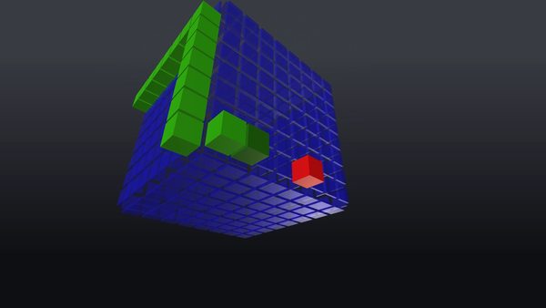

# Snake³

Snake³ is a simple snake game in three dimensions written in Unity.
The snake has to eat as much food as possible on the surface of a cube.

## How to Play

Download the latest executable for Windows from [Releases](https://github.com/hasdavid/Snake3/releases) here on GitHub.
No installation necessary.

Or open this project in Unity to compile it yourself.

## Controls

- Use `W`, `A`, `S`, `D` or the arrow keys for movement.
- Press `Esc` to open the menu.

## Credits

The game was written based on a screenshot I saw somewhere. The implementation is mine, but the idea belongs to the original author.
